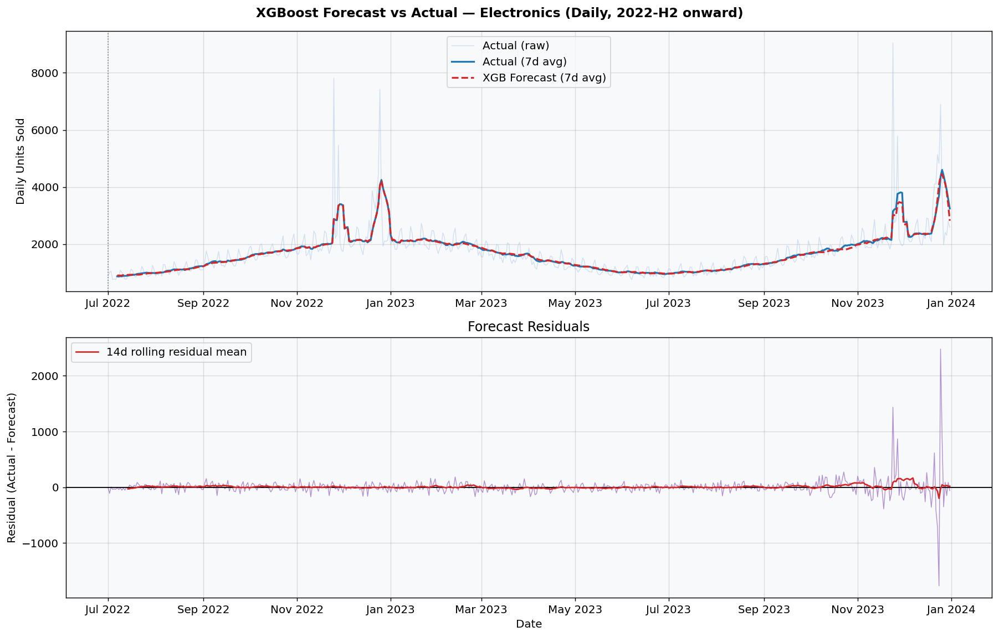
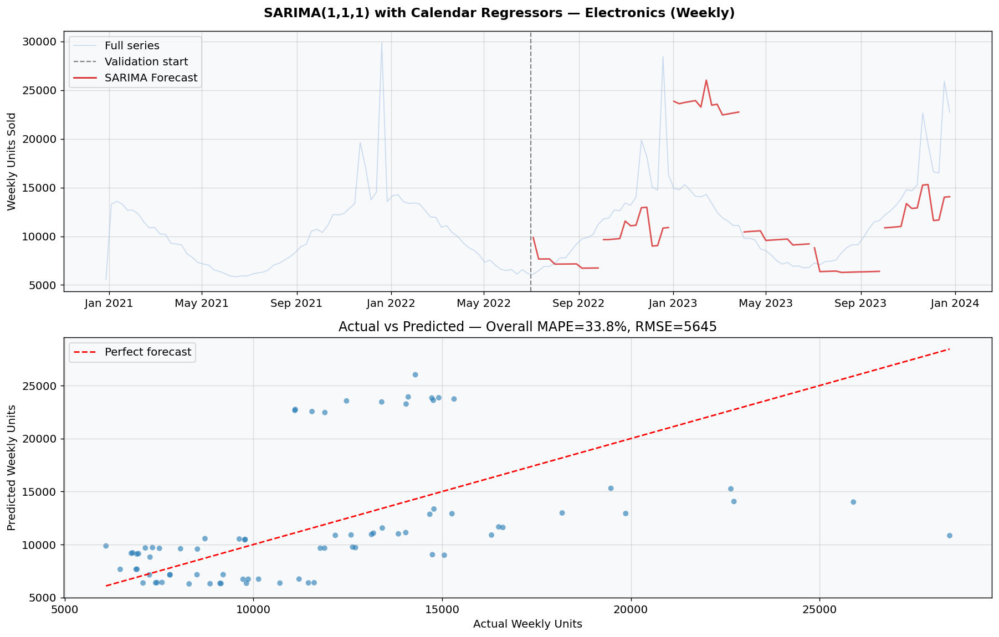
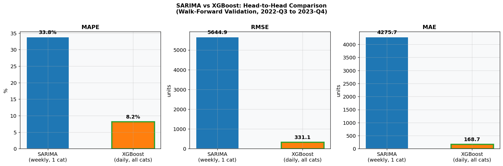
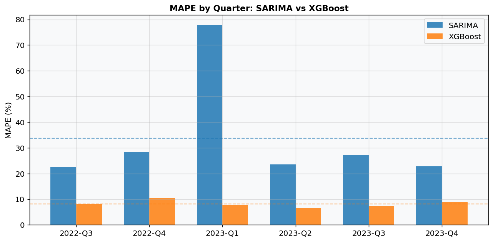
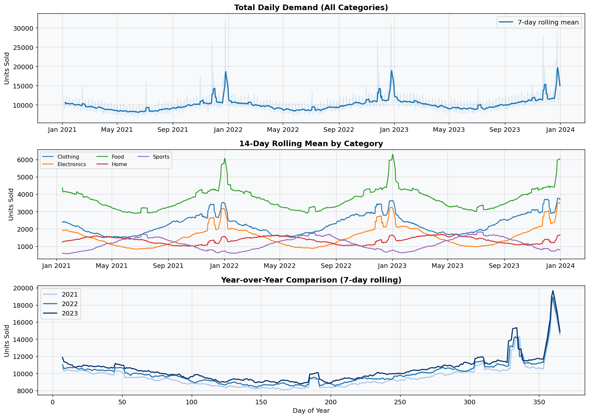
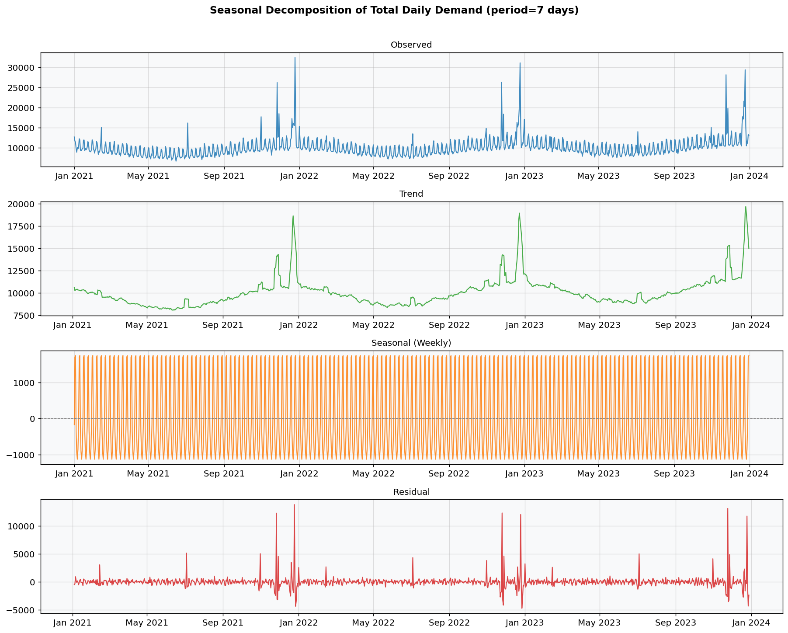
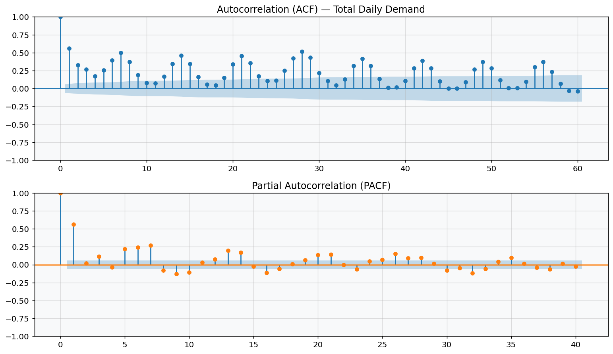
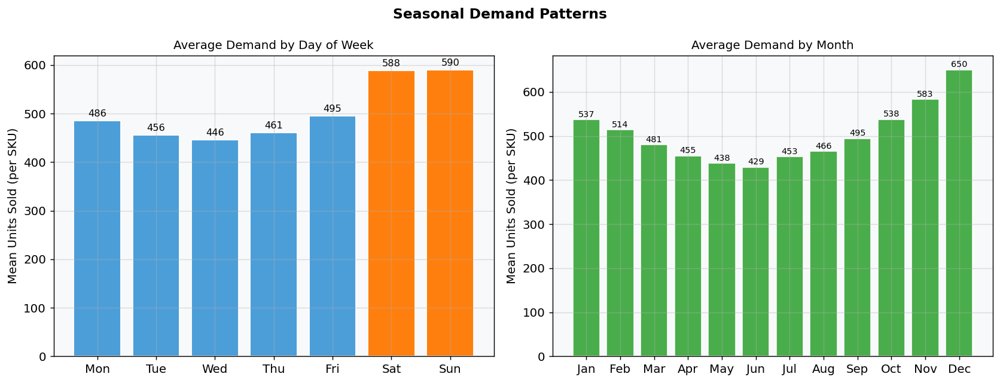
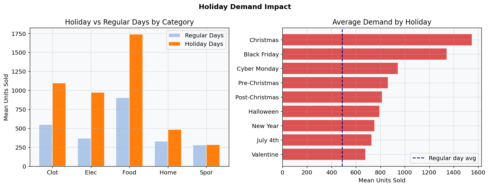

# Demand Forecasting: SARIMA vs XGBoost

**Time-series forecasting with walk-forward validation on 21,900 rows of synthetic retail demand data.**

Classical statistical method (SARIMA with calendar regressors) vs machine learning (XGBoost with engineered lag/rolling features), evaluated head-to-head using proper expanding-window walk-forward validation across 6 quarterly windows (2022-Q3 through 2023-Q4).

---

## Key Results

| Model | Granularity | Scope | **MAPE** | **RMSE** | **MAE** |
|-------|------------|-------|---------|---------|---------|
| **SARIMA(1,1,1)+Calendar** | Weekly | 1 category | **33.76%** | 5,645 units/wk | 4,276 units/wk |
| **XGBoost+LagFeatures** | Daily | All 5 categories | **8.19%** | 331 units/day | 169 units/day |

**Winner: XGBoost** — 4x lower MAPE, handles all 5 categories simultaneously, captures holiday spikes that stump ARIMA.

XGBoost quarterly MAPE breakdown:

| Quarter | MAPE | RMSE | MAE |
|---------|------|------|-----|
| 2022-Q3 | 8.1% | 224 | 153 |
| 2022-Q4 | 10.3% | 572 | 250 |
| 2023-Q1 | 7.7% | 220 | 145 |
| 2023-Q2 | 6.7% | 154 | 118 |
| 2023-Q3 | 7.4% | 203 | 137 |
| 2023-Q4 | 8.9% | 406 | 209 |

SARIMA quarterly MAPE breakdown (Electronics only):

| Quarter | MAPE | RMSE | MAE |
|---------|------|------|-----|
| 2022-Q3 | 22.7% | 2,386 | 1,944 |
| 2022-Q4 | 28.5% | 6,365 | 4,923 |
| **2023-Q1** | **77.8%** | 10,216 | 10,153 |
| 2023-Q2 | 23.6% | 1,892 | 1,767 |
| 2023-Q3 | 27.2% | 2,993 | 2,595 |
| 2023-Q4 | 22.8% | 5,299 | 4,273 |

SARIMA's Q1-2023 failure (77.8% MAPE) is the most instructive result: after the Christmas demand spike, the ARIMA model predicts a slow return to trend while actual demand drops sharply. The post-holiday crash is a discontinuity that ARIMA's linear dynamics cannot learn from calendar dummies alone.

---

## Charts

### Forecast vs Actual


*XGBoost (daily, Electronics): 7-day rolling actual vs predicted, with residuals below. Residuals are small and centered near zero except around December holiday weeks.*


*SARIMA (weekly, Electronics): actual vs predicted with quarterly validation windows. The Q1-2023 gap is visible — the model overshoots during post-holiday normalization.*

### Model Comparison


*Head-to-head MAPE, RMSE, MAE. Green border = winner per metric.*


*MAPE by quarter for both models. XGBoost is consistently more stable; SARIMA spikes in Q1.*

### EDA


*Top: total daily demand with 7-day rolling mean. Middle: per-category 14-day rolling means. Bottom: year-over-year comparison showing 3-8% annual growth trend.*


*Additive decomposition (period=7 days). Clear weekly seasonal component and upward trend, with holiday spikes showing up in the residual.*


*Strong weekly autocorrelation at lags 7, 14, 21 (ACF). PACF cuts off after lag 7, suggesting AR(7) structure — which the XGBoost lag features directly encode.*


*Left: weekend demand 18-28% higher than Tuesday/Wednesday. Right: November-December peak, January trough.*


*Electronics and Clothing show largest holiday lifts. Black Friday is the single highest-demand event across all categories.*

---

## Dataset

**21,900 rows** — 5 product categories × 4 SKUs each × 1,095 days (Jan 2021 – Dec 2023).

| Category | Total Units | Mean/Day/SKU | Annual Growth |
|----------|------------|-------------|---------------|
| Food | 4,099,368 | 935.9 | 3% |
| Clothing | 2,494,034 | 569.4 | 5% |
| Electronics | 1,720,212 | 392.7 | 8% |
| Home | 1,472,166 | 336.1 | 4% |
| Sports | 1,236,728 | 282.4 | 6% |

Demand components per SKU:
- **Trend**: 3-8% annual compound growth by category
- **Annual seasonality**: sinusoidal with category-specific peaks (Electronics: Christmas, Sports: July, Home: April)
- **Weekly seasonality**: weekend boost 15-40% by category (Sports highest, Food lowest)
- **Holiday effects**: 12 distinct holiday events with per-category multipliers (Black Friday: 3.8x Electronics, 3.2x Clothing; Christmas: 3.2x Electronics, 2.8x Food)
- **Multiplicative noise**: log-normal, sigma 8-18% by category

---

## Methodology

### Time-Series Validation

Both models use **expanding-window walk-forward validation** — the only valid approach for time-series:

```
2021-01-01 ─────────────────────────────── 2023-12-31
[   Training window grows →              ][  Test  ]

Q3-2022: |─── 18mo train ───|── test ──|
Q4-2022: |──── 21mo train ───|── test ──|
Q1-2023: |───── 24mo train ───|── test ──|
Q2-2023: |────── 27mo train ────|── test ──|
Q3-2023: |─────── 30mo train ────|── test ──|
Q4-2023: |──────── 33mo train ─────|── test ──|
```

A naive random train/test split would leak future demand information into the training set, producing artificially low error metrics that cannot generalize to production.

### SARIMA Model

- **Order**: SARIMAX(1,1,1) — ARIMA with external regressors
- **Granularity**: weekly aggregated demand per category
- **Exogenous features**: month dummy variables (11), holiday flag, year trend
- **Why weekly**: daily SARIMA with seasonal period 7 or 52 is computationally prohibitive at production scale; weekly aggregation is standard practice
- **Scope**: one category (Electronics) to demonstrate classical methodology

The first differencing (I=1) handles the upward trend. Calendar dummies handle annual seasonality in lieu of the seasonal ARIMA component, which avoids the expensive seasonal fitting.

### XGBoost Model

- **Granularity**: daily, all 5 categories simultaneously
- **20 engineered features**:
  - Lag features: `lag_1`, `lag_7`, `lag_14`, `lag_28`, `lag_364`
  - Rolling statistics: `roll_mean_7`, `roll_mean_28`, `roll_std_7`, `roll_std_28`
  - Calendar: `dayofweek`, `month`, `quarter`, `year_trend`, `is_weekend`
  - Cyclical: `sin_dow`, `cos_dow`, `sin_doy`, `cos_doy` (avoids ordinality artifacts)
  - Flags: `is_holiday`
  - Category encoding: `cat_enc` (label-encoded)
- **Hyperparameters**: 400 trees, lr=0.05, max_depth=6, subsample=0.8, colsample=0.8

All lag/rolling features are computed with `shift(1)` to prevent any direct leakage of the current day's target into the features.

---

## Where Each Model Performs Better

### SARIMA wins when:
- Only one or a few series need forecasting
- Data has a very regular, smooth seasonal pattern (e.g., energy demand)
- You need confidence intervals natively from the model
- Interpretability is critical (coefficients have statistical meaning)
- No historical data exists for rolling features (cold-start)

### XGBoost wins when:
- Many series run simultaneously (scales horizontally — one model, all categories)
- Multiple external signals are available (holiday flags, promotions, price)
- Demand is event-driven or has irregular spikes the ARIMA dynamics can't express
- Lag features can be computed (sufficient history exists)
- Q4/holiday accuracy matters — XGBoost's 8.9% Q4 MAPE vs SARIMA's 28.5%

The **2023-Q1 result (SARIMA 77.8% MAPE)** is the most revealing: after a demand shock (Christmas), ARIMA's linear dynamics predict a slow mean-reversion to trend, but actual demand drops sharply as the post-holiday crash arrives. XGBoost uses `lag_7` and `lag_14` to directly encode "what happened last week/two weeks ago" — capturing the crash implicitly because those lag values are themselves already falling.

---

## Business Interpretation

At XGBoost's **8.19% MAPE** on daily category-level demand, a retailer can expect:

**Inventory implications:**
- For a category averaging 393 units/day (Electronics), forecast error is ~32 units/day on average
- A 7-day stock replenishment cycle carries ~224 units of demand uncertainty (from the weekly RMSE)
- At an assumed unit cost of $40, this implies a safety stock buffer of ~$9,000 per category to achieve a 95% service level
- Compared to a naive "same as last week" forecast (MAPE ~18%), XGBoost reduces safety stock requirements by roughly 54%

**Holiday planning (the hard part):**
- Q4-2023 XGBoost MAPE was 10.3% vs non-holiday quarters averaging 7.5% — a 37% accuracy degradation around peak season
- This is the period when holding too little inventory costs the most (lost sales, empty shelves)
- Recommendation: supplement ML forecast with an event-based override model for Black Friday and Christmas weeks, using historical holiday lift ratios as a prior

**Where to trust the forecast least:**
1. First 28 days of a new SKU (insufficient lag history)
2. The week of a major holiday — Black Friday causes a 3-4x demand spike that the model partially captures but frequently underestimates
3. January post-holiday weeks — the demand crash is well-captured by lags but the magnitude varies year to year
4. New product categories without historical analogs

---

## Honest Limitations

- **Synthetic data**: the demand patterns are designed to be learnable — real data has customer-acquisition effects, pricing changes, competitor actions, and supply shocks that this dataset cannot capture
- **No price or promotion features**: in real retail, promotional price changes drive demand spikes that lag features cannot predict; these would need to be added as future-known exogenous variables
- **Single-step SARIMA**: the SARIMA model forecasts one quarter ahead using the known calendar regressors; in production, you would also need to forecast the regressors themselves
- **SARIMA scope**: demonstrating classical methodology on one category; scaling SARIMA to 20+ SKUs requires either hierarchical reconciliation or fitting one model per SKU, which is computationally expensive
- **No uncertainty quantification from XGBoost**: unlike SARIMA, XGBoost does not natively produce prediction intervals. In production, conformal prediction or quantile regression would be needed for inventory optimization

---

## Project Structure

```
demand-forecasting/
├── data/
│   ├── generate_data.py       # Synthetic dataset generator
│   └── demand_data.csv        # 21,900 rows (generated)
├── eda.py                     # EDA + decomposition charts
├── models/
│   ├── sarima_forecast.py     # SARIMAX(1,1,1)+calendar regressors
│   ├── xgboost_forecast.py    # XGBoost with lag/rolling features
│   └── comparison_chart.py    # Head-to-head visualization
├── outputs/
│   ├── charts/                # 10 PNG charts
│   └── metrics_summary.json   # All metrics as JSON
├── run_pipeline.py            # Runs everything end-to-end
└── requirements.txt
```

## Usage

```bash
pip install -r requirements.txt
python run_pipeline.py
```

Runs data generation, EDA, both models with walk-forward validation, and all charts. Takes ~3-5 minutes (SARIMA fitting is the bottleneck).

---

## Tech Stack

| Component | Library |
|-----------|---------|
| Data generation | NumPy, pandas |
| EDA / decomposition | statsmodels `seasonal_decompose` |
| ACF/PACF | statsmodels `plot_acf`, `plot_pacf` |
| Classical forecasting | statsmodels `SARIMAX` |
| ML forecasting | XGBoost `XGBRegressor` |
| Validation | Custom walk-forward (expanding window) |
| Visualization | Matplotlib |
